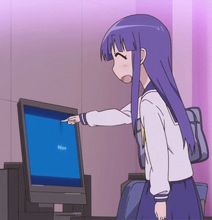

# 🦹‍♂️ About Myself

- Hey there! My name is Dot and I am just another guy who's into tech 🖥️ and music 🎵.

- I love learning and solving problems based on mathematics ➗, physics 📖 and logic 🧩 and developing applications based on them, like video games 🎮, tiny game engines 👾 or cryptographic 👨‍💻 applications.

- I also spend time learning 📚 and developing 🔬 different category of programs including video games 🎮, AI / ML 🤖, physics simulators 🎲, emulators, OSes and more.

- If you feel like hanging out with me, feel free to join my server! 😃

- My skills 💻 (already proficient and currently learning):
  

    
  

 
 

# 🔗 Links:

  
  
  
  

# 📊 My Stats :

  
 
 

